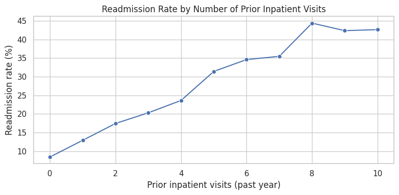

# Hospital Readmission Risk Analysis

Every year, U.S. hospitals get financially penalized for patients who
come back within 30 days of being discharged. This project digs into
real hospital data to find out who's actually driving that number
and what a hospital could realistically do about it.

## The question
Who's most likely to be readmitted within 30 days, and what should
the hospital do differently for them?

## The data
101,766 real hospital visits, 130 U.S. hospitals, diabetes patients
treated between 1999–2008 (UCI Machine Learning Repository). Messy,
real-world data several columns were missing for almost every
patient, so cleaning came first.

## What I found
The overall readmission rate is 11.2%. Age barely moves that number.
What actually matters is whether a patient's been hospitalized
before: patients with no prior admissions come back 8.4% of the
time; patients with 8+ prior admissions come back over 44% of the
time. That's the strongest signal in the whole dataset and it's
what a baseline predictive model picked up on too

## What I'd recommend
Target discharge follow-up (calls, home visits, case management) at
patients with 2+ prior admissions. That group carries 2–4x the
average risk a much smarter use of limited staff time than
treating every patient the same way at discharge.

## How it was built
Python (pandas, scikit-learn) + SQL (SQLite) in Google Colab →
Looker Studio dashboard. Built entirely on a phone, no laptop
required.

## Dashboard
[Live Looker Studio dashboard](https://datastudio.google.com/reporting/583808d1-4b70-4dec-a24f-5522d0d27840)

## Data source
UCI ML Repository — Diabetes 130-US Hospitals (1999–2008)
https://archive.ics.uci.edu/dataset/296/diabetes-130-us-hospitals-for-years-1999-2008
